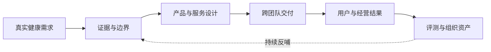
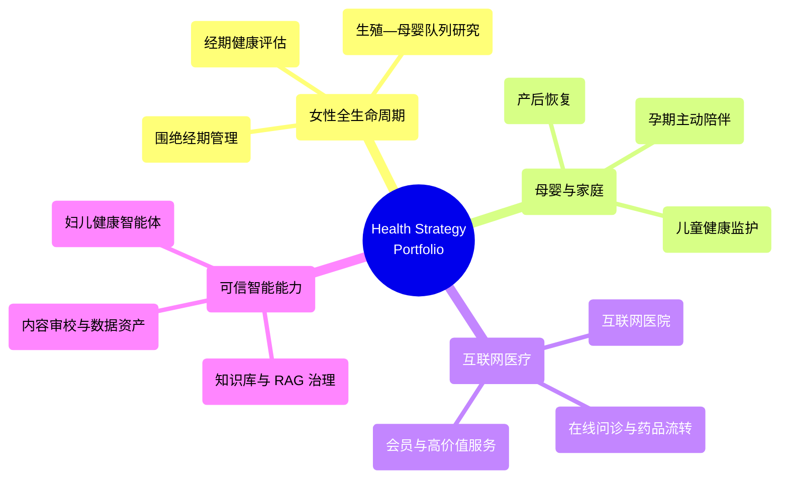
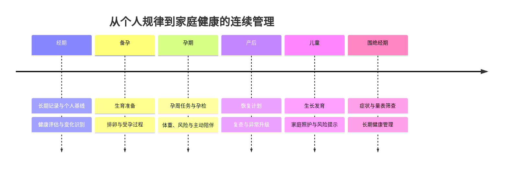
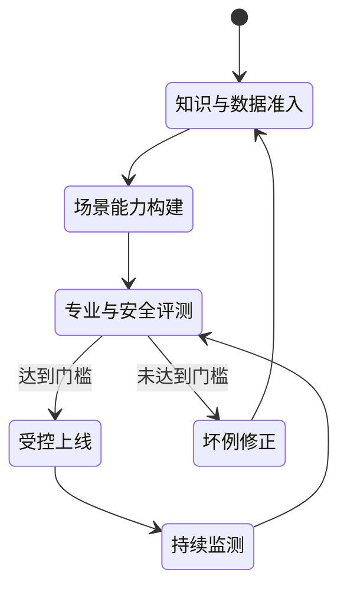
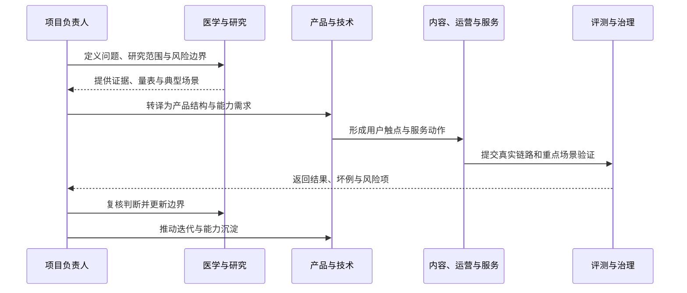

# Health Strategy & Digital Care

### 女性与家庭健康战略、数字医疗产品与可信 AI 实践

把真实健康需求转化为可验证、可交付、可持续运营的产品与服务体系。

`Women's Health` · `Maternal & Child Health` · `Internet Healthcare` · `Digital Health Research` · `Responsible AI`

[核心能力](#核心能力) · [项目地图](#项目地图) · [代表性工作](#代表性工作) · [推进方法](#推进方法) · [方法资产](#方法资产)

---

## 这是什么

这是一个以第一人称整理的数字医疗与健康科技工作组合，集中呈现我长期参与和推动的方向、代表性项目、决策方法与可复用资产。

工作重心覆盖女性健康、母婴健康、互联网医疗、连续健康管理及医疗 AI 治理。我的核心角色不是替代医学、产品或技术团队，而是把**用户问题、医学证据、业务目标和组织执行**连接成一套能够落地并持续迭代的结构。

> **阅读边界：** 本仓库呈现的是工作方向、项目方法和阶段性研究方案。涉及健康模型、风险提示或数字表型的内容，均需经过相应的临床验证、伦理审查和合规评估后，才能进入具体医学用途。

## 核心能力

| 能力支柱 | 解决的问题 | 典型沉淀 |
|---|---|---|
| **健康战略与业务判断** | 什么问题值得长期投入，怎样同时建立用户价值与经营闭环 | 业务定位、阶段目标、服务边界、资源优先级 |
| **专业研究与产品转译** | 如何把指南、量表、证据和风险边界变成用户能理解、团队能执行的结构 | 评估框架、产品规则、内容标准、服务路径 |
| **复杂项目与组织协同** | 如何让医学、产品、技术、内容、运营和服务围绕同一目标推进 | 分工机制、上线门槛、评测体系、复盘路径 |
| **可信数据与 AI 治理** | 如何让知识、数据、RAG、Agent 和工作流在医疗边界内稳定使用 | 知识准入、来源追溯、坏例治理、人工兜底 |

## 项目地图

### 女性与家庭健康的连续视角

这一视角的重点不是堆叠单点功能，而是让记录、评估、解释、提醒、服务和后续行动在不同生命阶段保持连续。

## 代表性工作

### 01｜女性数字健康与生殖—母婴全生命周期研究

**核心问题：** 长期用户记录能否形成稳定、可复现的女性数字健康表型；个人历史规律相对统一人群标准是否具有增量价值；经期特征是否与后续备孕、妊娠、分娩及儿童早期生长相关。

**推进结构：**

- 以经期健康度模型为起点，开展数据质量、构念效度、临床关联和前瞻性预测验证；
- 构建地区经期健康指数，探索与妇科、生育、分娩和公共卫生指标的地区层面关系；
- 连接经期、备孕、妊娠、分娩、产后和儿童生长数据，建设观察性生命周期队列；
- 将模型结论明确限定为待验证的研究假设，不把生态关联解释为个体因果关系。

**已形成的公开资产：**

[查看完整研究仓库 →](https://github.com/televgtamfe-coder/meiyou-womens-digital-health-research)

### 02｜女性与母婴健康产品体系

| 方向 | 关键问题 | 工作重点 |
|---|---|---|
| 经期健康评估 | 如何把长期记录转化为可解释的健康变化 | 维度化评分、缺失处理、个人基线、分层提示 |
| 围绝经期管理 | 如何识别症状、风险与适宜就医边界 | 个人档案、量表筛查、骨健康、睡眠与情绪管理 |
| 孕期服务 | 如何把孕周任务、内容和服务连接起来 | 孕期计划、周报、主动触达、文案与效果评测 |
| 产后恢复 | 如何回答“是否正常、下一步做什么、何时求助” | 阶段识别、恢复计划、记录测评、复查与异常升级 |
| 儿童监护 | 如何降低家庭对高频健康问题的不确定性 | 喂养决策、消化健康、风险分层和就医提示 |

### 03｜互联网医疗与服务闭环

- 参与并推动互联网医院从 0 到 1 的建设与落地；
- 围绕在线问诊、药品流转、复诊复购、医生质量与用户信任优化完整链路；
- 推动病例知识、内容、触达、服务和供应商管理形成统一口径；
- 在会员与高价值服务中关注信任、资源整合、体验稳定性和长期关系。

### 04｜可信医疗 AI、知识与数据治理

- 妇儿健康助手、专病智能体及端到端上线前评测；
- 医疗知识来源分级、准入、时效更新、替换与淘汰规则；
- RAG、知识图谱、Agentic 工作流与人工服务的边界设计；
- 医疗内容联网核验、证据留痕、问题归因与治理闭环；
- 妇产儿知识、病例、药品、问诊语料和评测数据的结构化沉淀。

## 推进方法

### 从研究到落地的协同结构

### 五个稳定动作

1. **定义真实问题**：识别谁在承担成本、问题为什么反复发生，以及不处理会放大什么。
2. **建立证据底座**：组织指南、共识、量表、研究和典型风险场景，区分解释、筛查与医疗边界。
3. **完成组织转译**：把专业结论变成用户语言、产品规则、内容标准、运营动作和服务判断。
4. **冻结阶段边界**：明确一期与长期目标、上线门槛、拒答范围、人工兜底和异常升级。
5. **评测并复用**：通过基线、坏例、回归和复盘，把一次交付沉淀为标准、模板和协同机制。

### 决策框架

| 判断层 | 核心问题 |
|---|---|
| 问题 | 它是否真实、持续，并影响用户结果或服务质量？ |
| 证据 | 哪些是事实，哪些是假设，哪些仍需验证？ |
| 方案 | 内容、工具、评估、服务和触达应该怎样组合？ |
| 执行 | 谁负责什么，什么先做，什么必须设置边界？ |
| 验证 | 用什么指标判断有效、无效或产生潜在伤害？ |
| 复用 | 项目结束后是否留下标准、数据、方法和组织能力？ |

## 工作原则

- **需求不是用户说了什么，而是用户正在承受什么。**
- **专业内容不是终点，转译和承接也是结果的一部分。**
- **复杂项目先讲清边界，再扩大范围。**
- **商业价值来自反复解决真实问题，而不是一次性上线。**
- **负责人需要持续校正集体判断，让局部目标回到同一核心问题。**
- **长期价值来自可复用的结构，而不只是一次成功。**

## 方法资产

本仓库还保留了用于复杂项目推进的 Skills、Agents、工作流模板与协同规则。它们不是工具清单，而是可重复使用的判断结构与交付规范。

| 资产 | 用途 |
|---|---|
| [Methods, Skills & Agents](./METHODS_SKILLS_AND_AGENTS.md) | 方法体系、使用原则与协同结构 |
| [Full Skills & Agents Inventory](./FULL_SKILLS_AND_AGENTS_INVENTORY.md) | 完整能力清单与来源索引 |
| [Women’s Digital Health Research](https://github.com/televgtamfe-coder/meiyou-womens-digital-health-research) | 经期健康度验证与生殖—母婴全生命周期研究 |

## 当前关注

目前持续关注三类能够形成长期资产的工作：

1. 女性个人健康规律相对统一人群标准的增量价值；
2. 经期、备孕、妊娠、分娩、产后与儿童健康数据的连续研究和产品转化；
3. 医疗知识、数据、RAG 与 Agent 在专业、安全、伦理和可审计边界内的真实应用。

如果你希望快速了解这套工作的研究主线，可从
[女性数字健康与生殖—母婴全生命周期研究](https://github.com/televgtamfe-coder/meiyou-womens-digital-health-research)
开始。

---

**把健康需求做成可验证的产品，把一次项目沉淀成可复用的能力。**

