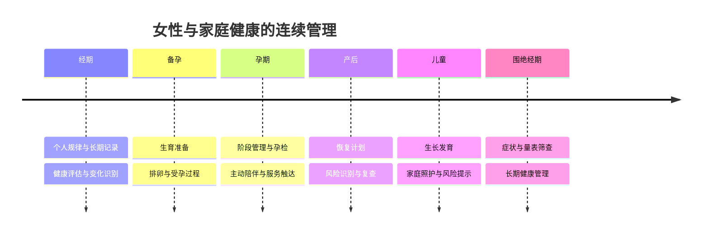
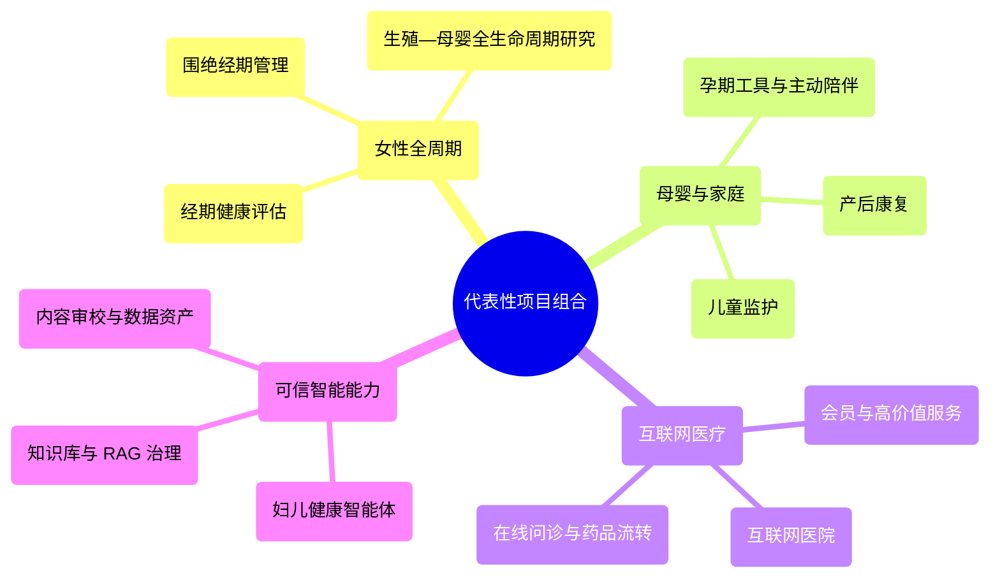
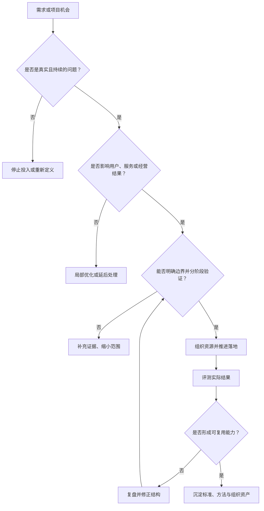
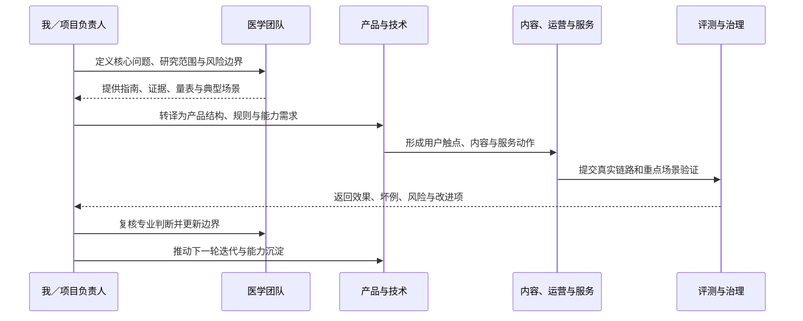
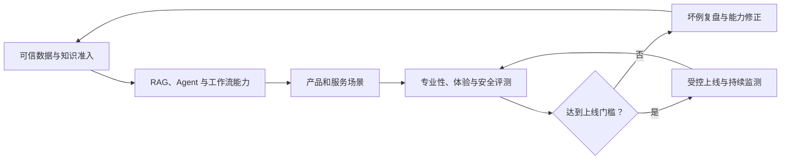

# Health Strategy & Digital Care

> 长期围绕数字医疗、互联网医疗、女性健康、母婴健康与健康服务体系建设展开工作，持续负责业务判断、项目推进、组织协同与关键能力落地。

`Digital Health` `Women's Health` `Maternal Care` `Internet Healthcare` `Health Service` `AI-Enabled Workflow`

---

  <a href="#about">About</a> ·
  <a href="#long-term-scope">Long-term Scope</a> ·
  <a href="#selected-work">Selected Work</a> ·
  <a href="#judgment-execution-and-methods">Judgment, Execution, and Methods</a> ·
  <a href="#closing">Closing</a>

## About

这些年我长期在数字医疗与健康科技领域工作，核心重心始终围绕女性健康、母婴健康、互联网医疗和连续健康管理展开。

我更习惯负责那些链路长、参与方多、判断复杂、又必须真正落到业务结果上的事情。相比只处理单个模块，我更关注一项业务能否形成完整闭环，能否在用户价值、服务质量、组织协同和长期经营之间建立稳定关系。

我做过的事情横跨互联网医院、在线问诊、药品流转、医药商业化、会员服务、海外医疗、内容与服务协同、健康管理工具，以及近年的智能能力建设与评测治理。但这些工作放在一起，本质上都在回答同一个问题：如何把真实健康需求，转成可持续、可承接、可迭代的业务与服务体系。

---

## Long-term Scope

> 长期负责的方向

### 女性健康与全周期管理

长期围绕女性健康管理开展工作，从经期、备孕、孕期到产后、围绝经期，持续关注不同阶段的核心问题、服务边界与承接方式。我更看重的不是单点内容覆盖，而是能否把评估、记录、提醒、解释、服务和后续触达真正连接起来。

### 母婴健康与家庭照护场景

在孕期管理、产后恢复、儿童监护与家庭健康管理方向上积累较深。很多项目并不只是解决一个功能问题，而是在高频刚需、风险预警、就医建议、内容理解和持续陪伴之间找到更合理的结构，让用户在不同阶段都知道自己现在处于什么状态、下一步该做什么。

在婴幼儿健康管理方向，也持续负责过喂养决策、消化健康、便便识别、家庭照护判断与风险提示相关项目。我更关注的不是做一个单点工具，而是把家庭里那些高频、琐碎、又容易引发焦虑的问题，整理成用户能看懂、团队能承接、服务能接得上的管理结构。

### 互联网医疗服务闭环

持续负责在线问诊、药品流转、医药商业化等相关业务模块的设计与推进。我关注的不只是一个入口的转化，而是提醒、触达、转化、复诊、复购、服务体验、医生质量和用户信任能否形成完整链路。

### 互联网医院与综合服务体系建设

参与并推动过互联网医院从 0 到 1 的建设与落地。对我来说，这类项目真正重要的不是系统上线本身，而是业务规则、服务流程、组织分工、协同机制和产品工具能否形成一套长期可运转的结构。

### 医学内容、证据治理与服务协同

长期负责医疗健康内容、专业知识与服务动作之间的协同建设。很多时候我更关注的不是内容写得多不多，而是专业信息能不能进入真实业务链路，能不能被稳定地用于用户解释、服务判断、风险提示和后续承接。

### 医疗数据资产与知识准入建设

除了前台产品和服务体系，我也长期参与医疗数据资产、知识准入标准、评测口径和内容生命周期治理相关工作。这部分工作通常不直接对外显性，但它决定了一项业务能不能长期稳定迭代，能不能在复杂场景里保持一致性。

### 会员服务、海外医疗与高价值用户服务

也持续负责过高端会员服务、海外医疗与高价值用户服务体系相关工作。这类工作更强调信任建立、资源整合、体验稳定性与长期关系维护，既要求业务判断，也要求跨团队和跨角色的复杂协同能力。

---

## Selected Work

> 代表性项目与项目面

### 经期健康评估与长期记录体系

围绕经期健康度建设过较完整的评估体系，把周期、规律性、经期长度、流量、痛经、经期症状与非经期症状纳入统一框架，并结合缺失值处理、分层评分、典型案例校验和组合验证，形成可解释、可分层、可长期跟踪的健康评估结构。

这类项目的重点不只是把记录做成分数，而是让记录结果能真正帮助用户理解自身状态，并为后续提醒、关注建议、异常识别与服务承接提供依据。

### 女性数字健康与生殖—母婴全生命周期研究

在经期健康评估与长期记录体系的基础上，我们进一步把这项能力延伸为女性数字健康与生殖—母婴全生命周期研究项目。

我们认为，美柚长期积累的用户记录，不应该只用于完成一次经期预测或风险提示。真正独特的价值，在于一部分用户已经形成了跨越多年、覆盖多个生命阶段的连续健康轨迹。相较于只使用统一人群标准，这些数据让我们有机会同时理解“一个人是否偏离一般人群”以及“她是否偏离了自己的长期稳定状态”。

围绕这一判断，我们把项目沿三条主线推进：

- 以经期健康度模型为起点，验证长期记录、个人基线、评分结果与临床表型之间的关系；
- 将地区经期健康指数与妇科疾病、生育、分娩及公共卫生指标进行规范化匹配，研究地区层面的健康差异；
- 连接经期、备孕、妊娠、分娩、产后和儿童生长数据，建设生殖—母婴全生命周期观察队列。

我们希望最终形成的不只是论文或单一评分，而是一套能够持续沉淀数据标准、临床证据、个人化分析、健康解释和产品服务能力的研究平台。现阶段，我们把相关结论作为需要被验证的科学假设，不把模型提前表述为诊断工具，也不把地区关联直接解释为个体因果关系。

- [完整项目：美柚女性数字健康与生殖—母婴全生命周期研究](https://github.com/televgtamfe-coder/meiyou-womens-digital-health-research)

### 围绝经期健康管理

围绕围绝经期做过较系统的方案设计，覆盖个人档案、症状识别、量表筛查、骨健康风险、睡眠、情绪、泌尿生殖道问题以及生活方式改善等多个模块。

在这类项目里，我重点推进的是三件事：先把用户端真正需要收集的关键信息理清，再把 KMI、MRS、PHQ-9、GAD-7、PSQI、OSTA 等量表或筛查工具放到合理位置，最后把结果解释、风险边界、就医建议和可承接的服务动作串起来。这样做的目的，不是把项目写得更专业，而是让用户真正知道哪些问题适合持续管理，哪些问题需要及时就医。

### 孕期服务工具与内容评测

在孕期方向，持续推动过孕期计划、孕期周报、计划完成分析、文案可用率评测与优化迭代。相关工作既包括内容结构和表达方式的设计，也包括评测标准、错误样本复盘、可用率分析和上线前质量校验。

这类项目很能体现我一贯的做法：不是只把内容写出来，而是把生成逻辑、表达边界、任务目标、用户情绪、可执行建议和评测方法一起定义清楚，让内容真正成为服务的一部分，而不是一段看起来正确但难以使用的话。

### 产后康复与恢复管理体系

围绕产后恢复方向，我推动过从前期研究、需求拆解、证据梳理到方案设计和系统化产品结构搭建的一整套工作。这个方向里，我比较看重的一点是，产后不是一个单点内容问题，而是一个关于恢复确定性和下一步行动指引的连续管理问题。

从用户视角看，真正反复出现的问题其实很朴素：我现在这样正常吗，我接下来该做什么，我有没有在变好，我什么时候必须求助。围绕这个判断，我会把阶段识别、风险提醒、计划、记录、测评、复查提醒和异常升级拆成一条完整链路，而不是把项目理解成“再补一点产后内容”。

### 儿童监护与家庭健康管理

在儿童监护和家庭健康管理方向，也做过比较完整的第一性需求拆解与产品结构设计。比如在婴幼儿便便识别与消化健康管理方向，核心思路不是做一个孤立的识别功能，而是围绕高频轻症、中频预警和低频高风险问题建立更有层次的识别与引导体系。

这类项目的价值，在于它把家庭照护场景里非常具体、非常高频、也非常容易焦虑的问题，转成一种更可理解的管理结构。既能帮助用户处理当下，也能在真正需要的时候把风险识别和就医建议前置出来。

### 在线问诊、病例知识与服务转化协同

在互联网医疗业务中，我也长期负责问诊相关链路优化，包括问诊入口、复购策略、触达机制、病例知识的组织方式、医生资源质量管理，以及 AI 初筛与真人接诊之间的协同路径。

我一直比较在意的是，问诊不应该只是一个下单动作，而应该放在完整服务链路里看。入口配置、提醒触达、病例推荐、复诊消息、服务体验、供应商医生监管、客诉控制和内容专业度，其实共同决定了这条业务链路是不是稳定、是不是值得信任、是不是能持续增长。

### 孕期主动陪伴与阶段性触达体系

除了孕期内容和周报，我也持续负责过孕期场景中的主动触达、阶段性陪伴和对话转化体系建设。重点不是简单增加消息触点，而是围绕不同孕周、不同状态和不同任务阶段，设计更合适的开场方式、触达内容、进入路径和承接动作。

这类项目的核心在于把原本被动等待用户发起的服务，逐步做成阶段性陪伴的一部分。很多时候我更看重的是，触达之后用户是否更愿意表达真实问题，后续对话能否承接住，整体服务体验是否因此变得更连贯。

### 妇儿健康智能体与上线前评测治理

在妇儿健康相关的智能服务建设中，我持续推动过健康助手、专病场景智能体、端到端体验评测和上线前治理。对我来说，项目重点从来不只是把能力做出来，而是上线前有没有把体验、专业性、安全、伦理、边界和坏例复盘先跑通。

很多项目推进过程中，我会把评测做成真正的经营动作，而不是形式化检查。包括建立体验基线、拆分问题类型、组织多轮回归、跟踪坏例修复、明确红线问题和上线门槛。这样做的价值，是让团队不是凭感觉推进，而是有一套持续可复用的判断标准。

### 医疗知识库准入、RAG 治理与可信回答结构

在医疗知识治理方向，我推动过知识来源分级、证据等级判断、时效性更新、内容替换与淘汰规则建设。相比单纯把资料放进知识库，我更在意的是它是否值得被引用，是否适合进入回答链路，是否需要被更新、替换或直接剔除。

很多时候这部分工作的真正意义，是把“能不能回答”从模糊判断，变成有依据的准入标准。哪些内容适合做背景知识，哪些内容适合做直接依据，哪些内容只能作为补充说明，哪些场景必须保留人工或医疗边界，我通常会先把这些结构立起来，再让后续能力建设进入业务。

### 医疗健康内容联网审校与证据化治理

围绕医疗健康内容，我也推动过从人工经验审校走向证据化审校的体系化工作。重点不是把每一条内容都重新写一遍，而是建立一套可复核、可追溯、可记录依据的审校结构，让问题能被发现，也能被解释清楚。

这类项目里，我更看重的是三件事：一是坚持联网核验和来源留痕，二是让问题原因和引用依据可以回看，三是把审校结果真正反哺到内容治理和知识更新里。这样内容质量就不再只依赖个体经验，而能逐步沉淀成组织能力。

### 医疗数据资产建设与结构化沉淀

在项目推进过程中，我也长期负责医疗数据资产的准备、清洗、结构化和场景适配，包括妇产儿知识、病例、药品、问诊语料和评测数据等方向。对我来说，这部分工作不是后台支持，而是很多项目能不能继续往前推进的基础条件。

我通常会更关注三个层面：数据是不是足够贴近真实场景，结构是不是足够支持后续评测和能力迭代，团队是不是能在后续项目里重复使用。这类工作看起来不如前台业务直接，但往往最能决定一个项目是不是只做成一次，还是能持续长出来。

### 带领医学博士团队从调研到落地的项目推进

很多医疗健康项目，我都不是把它理解成单一产品项目，而是一个从研究、证据、结构化转译到上线承接的完整推进过程。我长期会带领医学博士团队和专业医学同学一起，把临床指南、专家共识、量表工具、风险边界和典型场景整理成可落地的业务结构。

我比较重视的不是让研究显得更厚，而是让研究真正能进入业务。什么内容可以进入产品，什么适合进入服务，什么必须作为边界提醒保留，什么需要在上线前先经过评测和门禁，这些通常都会在项目早期被定清楚。很多项目最后之所以能稳定落地，靠的不是某一个点做得特别快，而是整个过程从一开始就被理顺了。

---

## Judgment, Execution, and Methods

### 我通常如何判断一个需求

我通常不会先从“要做什么功能”开始，而是先回到更前面去看，这件事到底在解决什么问题。

很多时候，团队拿到的是一个已经被包装过的方案，但真正值得判断的，是这个方案背后的原始问题是什么，是谁在承担成本，问题为什么会反复出现，现有结构为什么承接不住，以及这件事如果现在不处理，会在哪些地方继续放大。

我会重点看几件事：

- 这是不是一个真实存在、会持续发生的问题
- 它影响的是局部体验，还是更大的服务质量和业务效率
- 现在做这件事，是补一个局部缺口，还是在解决一个结构性问题
- 这件事有没有明确边界，能不能分阶段推进
- 一旦做成，能不能沉淀为长期能力，而不只是一次性交付

在很多健康相关项目里，我尤其看重第一性需求的判断。因为健康场景里最容易出现的误区，就是把表面诉求当成真实需求，把局部功能当成解决方案。真正重要的，是先找到用户在那个阶段最本质的不确定性，再决定内容、工具、服务、评估和触达应该怎么组合。

### 我如何带团队把项目从调研推进到落地

我做这类项目，通常不是单靠某一个角色完成的，而是带着医学、产品、内容、运营、服务和相关协同团队一起，把事情从研究推到上线。

尤其在医疗健康相关项目里，我长期会带领医学博士团队或专业医学同学一起工作。我的职责不是替代他们做专业判断，而是把专业研究、业务需求、用户理解和组织执行真正接起来。

我通常会按这样的路径推进：

#### 1. 先把研究范围和核心问题定清楚

先明确这个项目要解决什么问题，核心决策点是什么，用户处在哪个阶段，哪些问题属于高频管理问题，哪些问题属于必须严肃对待的风险边界。只有前面这一层清楚了，后面的文献、指南、量表和方案设计才不会发散。

#### 2. 组织医学博士团队做证据梳理

接下来会带医学博士团队系统梳理文献、临床指南、专家共识、量表工具和典型风险场景，先建立专业依据和证据分层。对我来说，这一步不是为了堆专业信息，而是为了把哪些内容可以用于解释、哪些适合用于筛查、哪些必须保留医疗边界，先分清楚。

很多时候我也会把这一步进一步拆细，让不同背景的医学同学分别负责指南综述、量表与评估工具、风险症状整理、边界案例补充和典型问答校对。这样做的重点不是把研究做得更重，而是保证后面进入方案设计时，团队手里拿到的是经过整理、可以直接转成产品和服务动作的材料，而不是一堆彼此分散的专业结论。

#### 3. 把专业内容转成用户可理解、团队可执行的结构

证据梳理之后，最关键的一步是转译。我会把专业结论继续往下拆，变成用户听得懂的话、产品团队能实现的模块、内容团队能表达的方式、运营团队能承接的动作，以及服务团队能执行的判断标准。

很多项目能不能真正落地，关键就在这里。不是因为大家不知道专业知识，而是因为没有人把专业知识转成组织可以一起执行的结构。

#### 4. 明确边界、阶段和上线标准

在进入方案设计和落地前，我会把边界讲清楚：哪些是评估，哪些是筛查，哪些只是提醒，哪些必须导向线下就医；哪些属于一期，哪些放到后续；哪些是项目目标，哪些不能被夸大成结果。

这一步会直接影响后面的风险控制、团队分工和上线质量。

如果项目里涉及智能能力、知识库或服务判断，我通常还会把知识准入、来源溯源、风险分层、拒答范围、人工兜底和上线评测标准一起定下来。因为在健康场景里，很多问题不是做出来就结束了，而是上线之后能不能长期稳定、能不能经得起真实使用和坏案例回看。

#### 5. 建立评测、复盘和持续优化机制

我一直比较重视评测和复盘。对外能不能用，不是看大家都觉得差不多，而是看有没有明确标准、有没有坏例子复盘、有没有持续迭代的方法。无论是内容、智能能力、服务链路还是知识库治理，我都会尽量让团队留下统一口径、评测标准和后续优化路径。

所以很多项目到最后，不只是完成了一个版本上线，而是同时沉淀出一套后续还能复用的判断标准、评审方式和协同路径。对我来说，这才算真正把项目做成了组织能力，而不是只做完了一次交付。

### 我常用的组织与推进方式

#### 用结构化方法处理复杂问题

越复杂的事情，越不能只靠感觉推进。我会先把问题拆成判断层、方案层、执行层和验证层，再决定哪些先做，哪些后做，哪些要并行推进，哪些必须先对齐。

#### 抓关键矛盾，不平均用力

项目做不动，很多时候不是努力不够，而是关键矛盾没有找准。我习惯先识别最影响结果的那一两个点，再围绕它组织资源、排序节奏、压缩不必要的分散动作。

#### 重视协同，也重视统一口径

在健康科技和互联网医疗领域，跨团队协同是常态。医学、产品、内容、运营、服务、技术、供应商管理，任何一方的口径不一致，最后都会体现在用户体验和业务结果上。所以我一直很重视统一语言、统一边界和统一判断标准。

#### 把项目做成能力，而不是一次性交付

我不太喜欢只交付一个结果就结束的方式。相比一次性完成，我更看重这件事有没有留下长期能复用的方法、模板、评价体系、知识结构和协同机制。因为组织真正需要的，通常不是一次成功，而是可持续复制的能力。

### 对技术框架和 AI 应用的理解

我不是以研发负责人的方式去谈技术，但我一直非常重视技术框架、能力结构和实际承接方式。

这些年我持续推动过知识库治理、RAG 结构、知识图谱、评测框架、多模态 Agent、Agentic 工作流、MCP 与相关能力组合，也做过 AI 就绪数据治理、结构化处理、模型训练尝试和产品功能的智能化升级。

在我看来，这些能力最重要的价值，不在于概念本身，而在于它们是否真正进入业务链路，是否提高判断效率、服务效率和协同效率，是否在医疗安全、伦理和一致性边界内被正确使用。

所以在 AI 应用上，我始终更关注三件事：

- 能不能解决真实问题，而不是制造看起来先进的动作
- 能不能和现有业务、服务、内容和组织流程接起来
- 能不能建立评测、准入和风险控制机制，保证它长期可用

### 一些关于商业、组织与长期价值的看法

这些年项目做多了，我越来越觉得，很多事情最后拉不开差距，不是因为谁更会写方案，或者谁更会做功能，而是因为有没有先把问题放进一个正确的商业和组织结构里。

我一直比较相信，真正能长期成立的业务，往往都有几个共同点：它解决的是反复出现的真实问题；它不是只靠一次触达，而是能形成后续承接；它不是只在一个团队里讲得通，而是能在组织里被持续执行；它不是靠短期推动勉强跑起来，而是能逐步沉淀成稳定能力。

所以我看很多项目时，第一反应往往不是“能不能做”，而是“做完之后会不会留下什么”。如果只是上线一个版本、完成一次传播、解决一个表面问题，那价值通常很快就会耗尽。真正值得长期投入的，是那些做完之后能留下服务闭环、判断标准、协同方式、用户关系和后续放大空间的事情。

我也一直觉得，组织里很多低效，并不是大家不努力，而是每个人都在从自己的局部视角理解同一件事。医学从专业性出发，产品从模块出发，运营从转化出发，服务从承接压力出发，管理者如果不能把这些局部目标重新收束回同一个核心问题，项目就很容易越做越散。负责人真正重要的价值，很多时候不是多做一层动作，而是把不同角色重新带回同一个判断框架里。

从这个角度看，所谓商业观念，并不只是增长、收入或策略选择。它更像是一种持续判断：什么问题值得长期做，什么能力值得反复投入，什么环节应该标准化，什么部分必须保留弹性，什么可以被规模化复制，什么一定要有人盯住边界。很多业务做到后面，比的都不是动作有多花，而是谁更早把这些事情想明白。

### 我常用的知识框架与 skills 结构

我平时不太把这些东西叫方法论，但这些年确实慢慢形成了一套比较稳定的处理方式。面对复杂问题时，我通常会先搭框架，再推动动作。因为如果前面的判断结构没有搭好，后面做得越快，偏差往往也会越大。

我常用的框架大致会分成几层：先看问题层，确认这件事到底在解决什么；再看证据层，判断现有信息、研究、数据、案例和业务事实够不够支撑决策；然后进入方案层，把它转成用户能感知、团队能执行、业务能承接的结构；再往下是执行层和评测层，用来保证项目不是停留在纸面上，而是真正能跑起来、看得见效果、经得起复盘。

如果把它说得更直白一点，我通常会反复问这些问题：

- 这件事真正的问题是什么
- 这个问题是谁在承担成本
- 现在最需要被解决的核心矛盾是什么
- 哪些信息是事实，哪些只是想象
- 什么内容适合放进产品，什么更适合放进服务，什么只能作为边界提醒
- 这件事上线之后，怎么判断它是不是在往对的方向走

至于所谓 skills，我更习惯把它理解成一种稳定的处理能力，而不是一个标签。比如做需求判断的能力、做复杂问题拆解的能力、把专业研究转成业务结构的能力、把项目从调研推进到落地的能力、把上线后的评测和复盘继续接住的能力。这些能力单看都不算新，但真正难的是把它们放在一起，形成一套能长期复用的组织动作。

所以很多时候，我做的并不是单纯管理一个项目，而是在不断把零散经验整理成更稳定的框架。这样团队下一次再遇到相似问题时，不需要从头摸索，而是可以站在更成熟的判断结构上继续往前走。

关于这些方法资产本身，我另外整理了一份附录，专门记录我长期使用和沉淀的 `skills`、`agents`、工作流模板与协同规则。它们对我来说，不是工具清单，而是面对复杂项目时反复复用的判断结构、推进路径与交付规范。

- [Methods, Skills & Agents](./METHODS_SKILLS_AND_AGENTS.md)
- [Full Skills & Agents Inventory](./FULL_SKILLS_AND_AGENTS_INVENTORY.md)

### 从这些项目里沉淀下来的几条稳定判断

做过足够多项目之后，人会慢慢知道，什么是表面热闹，什么是底层有效。对我来说，下面这些判断，是这些年反复被验证过的。

#### 需求不是用户说了什么，而是用户正在承受什么

用户说出口的，很多时候只是表层表达。真正重要的是，她在哪个阶段、面对什么问题、承担了什么不确定性、为什么现在会焦虑、为什么原来的方式已经不够用了。只看表面诉求，很容易做出一个看起来合理、但实际承接不住的方案。

#### 真正值得做的项目，通常都能穿过多个部门

如果一件事只在某一个小范围里成立，往往说明它还只是局部优化。真正重要的项目，通常会同时牵动业务、产品、内容、服务、运营、供应链、质量管理甚至更上层的资源判断。跨部门不是麻烦本身，恰恰说明这件事更接近真实业务。

#### 专业内容本身不是结果，转译能力才是结果的一部分

我一直很重视专业度，但也越来越清楚，专业内容如果不能被转成用户理解、团队执行、服务承接和业务协同的一部分，那它的价值就停留在专业本身。真正产生结果的，通常不是信息拥有量，而是转译能力。

#### 很多项目输在过早做大，赢在先把边界讲清楚

越是复杂项目，越不能一开始什么都想做。边界越不清楚，后面越容易失真、失控、失焦。先把一期做什么、不做什么，哪些是能力，哪些只是表达，哪些是上线目标，哪些只能作为长期方向讲清楚，项目反而更容易走得稳。

#### 长期价值往往来自可复用，而不是一次成功

我一直比较在意一件事做完之后有没有留下结构。有没有留下标准，留下框架，留下评测方式，留下协同路径，留下更容易复制的动作。如果没有，那很多成功都只是一轮性的；如果留下了，这件事才真正变成组织资产。

#### 负责人最重要的工作之一，是持续校正集体判断

项目往前走的过程中，团队一定会因为信息差、角色差、压力差出现偏移。有人会更激进，有人会更保守，有人更关注效率，有人更关注风险。这个时候负责人最关键的作用，不是替所有人做所有事，而是持续把大家拉回同一个核心问题上，确保整个组织的判断不散。

---

## Closing

### 结尾

这些年我长期做的，其实都是同一类事情。

就是围绕数字医疗、女性健康、母婴健康和互联网医疗服务，去处理那些既复杂、又具体，既需要判断，又需要推进，既关乎用户体验，也关乎业务结果的事情。

我一直更喜欢把事情做成。不是停留在一个想法、一份方案或一个局部功能，而是把它变成真正能承接用户、能协同团队、能稳定运转的业务、项目和服务体系。
