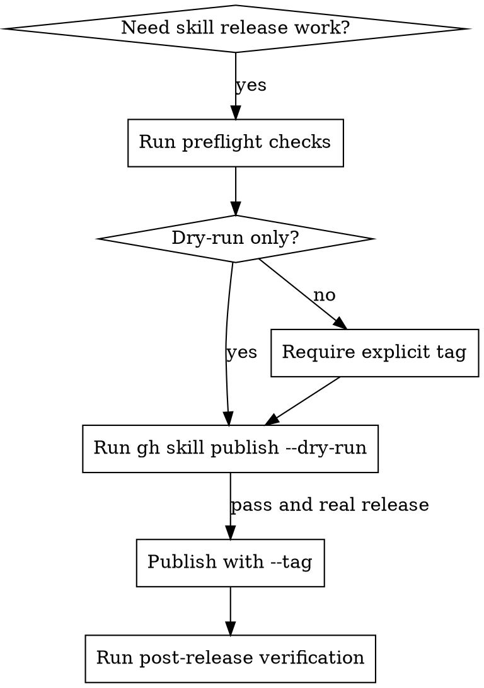

# GitHub Skill Publishing

## Overview

Release `topdown-tutor` skills in two phases: preflight plus dry-run, then publish plus verify. Treat `D:/topdown-tutor/skills` as the source of truth and require the packaged mirror under `D:/topdown-tutor/plugins/topdown-tutor/skills` to stay in sync before release.

## Scope

Use this skill for:

- release readiness checks
- `gh skill publish --dry-run`
- real GitHub skill publishing with an explicit tag
- post-release preview or install verification
- plugin mirror parity checks for this repo

Do not use this skill for:

- generic GitHub PR work
- GitHub Actions authoring
- non-skill application deployment
- release work outside `topdown-tutor`

## Decision Gate

## Core Rules

1. Treat `skills/` as the source of truth.
2. Mirror publishable content into `plugins/topdown-tutor/skills/` before release.
3. Run `gh skill publish 'D:/topdown-tutor' --dry-run` before any real publish.
4. Require an explicit semver-style tag such as `v0.1.4` for real publish work.
5. Never treat a successful publish command as enough. Verify the release with `gh release view`, `gh skill preview`, or `gh skill install`.
6. If the user asked only for readiness or dry-run, stop before publish and report blockers or readiness clearly.

Repo note:

- In this repo, `gh skill install --from-local` and `gh skill preview` can resolve the packaged copy under `plugins/topdown-tutor/skills/`, so mirror parity is a release requirement, not an optional cleanup step.

## Release Order

1. Identify the target skill and whether the request is readiness-only, dry-run-only, or real publish.
2. Read `references/preflight-checklist.md` and run the blocker checks.
3. Sync the source skill tree into `plugins/topdown-tutor/skills/`.
4. Read `references/release-runbook.md` and run `gh skill publish 'D:/topdown-tutor' --dry-run`.
5. Stop immediately if dry-run fails.
6. For real publish, require an explicit tag and publish non-interactively with `--tag`.
7. Read `references/post-release-verification.md` and prove the published result is usable.
8. If anything fails, use `references/common-failures.md` and report the blocker before taking more release actions.

## Stop Conditions

Stop and surface the blocker if any of these are true:

- `gh auth status` is not healthy
- `git status` is dirty and the user did not intentionally approve releasing from that state
- the source skill folder or `agents/openai.yaml` is missing
- the plugin mirror is missing or stale
- the release tag is unclear, missing, or already exists
- dry-run fails
- post-release preview or install verification fails

## Quick Reference

| Need | Read first | Main command |
| --- | --- | --- |
| Readiness check | `references/preflight-checklist.md` | `gh skill publish 'D:/topdown-tutor' --dry-run` |
| Real publish | `references/release-runbook.md` | `gh skill publish 'D:/topdown-tutor' --tag <tag>` |
| Verify release | `references/post-release-verification.md` | `gh release view <tag>` |
| Diagnose blocker | `references/common-failures.md` | blocker-specific commands |

## Common Mistakes

- Publishing directly without a fresh dry-run.
- Releasing from `skills/` but forgetting the mirrored plugin package.
- Letting `gh skill publish` choose the flow interactively instead of using an explicit `--tag`.
- Reporting success from the publish command before checking preview or install behavior.

## References

- `references/preflight-checklist.md`
- `references/release-runbook.md`
- `references/post-release-verification.md`
- `references/common-failures.md`
